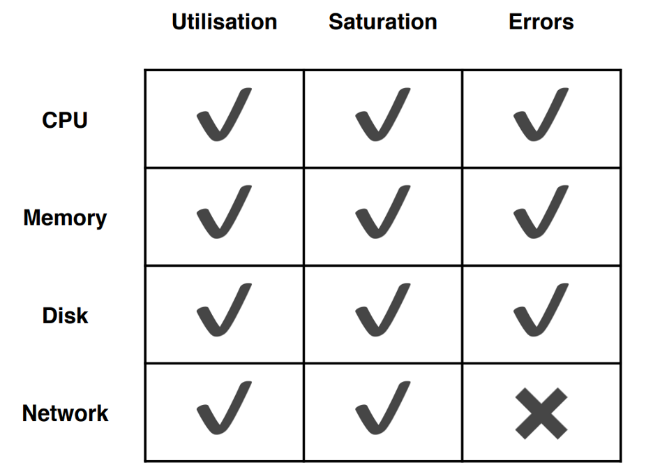

# SITE RELIABILITY ENGINEERING (SRE) AT BRITISH COLUMBIA WITHIN THE PLATFORM AS A SERVICE (PAAS) – WHITE PAPER

This white paper is more of research analysis of British Columbia’s environment and identifying how to setup SRE related activities. This paper also provides some information about some common SRE principles and procedures. The paper will also provide a walk through of an example Product Team setting SRE objectives, indicators, monitoring, and observability with BC PaaS. 
## IDENTIFICATION OF ENVIRONMENTS FOR THE PAAS
It is important to notate that not all environments are created equal but if these cluster have core services or dependences then these need to be identified. Below is a list of environments currently identified for the BC PaaS.
•	Gold Cluster
•	Silver Cluster
•	Emerald Cluster
•	KLab Cluster
•	ROSA Cluster – **In Progress**

## GOALS AND VISION FOR EACH ENVIRONMENT
The goals and the vision for each environment is important. As this helps identify WHO IS THE CUSTOMER. There are two main categories for these environments:
•	Utilized by Product Teams
•	Utilized for Development and Test
**Note:** So, there should be more categories broken down between Gold Cluster, Silver Cluster, and Emerald, as the environments identify a different type of customer. 
For now, based on the information lets break apart the environments where the customer is the product team. 

**Product Team Environments:**
•	Gold Cluster
•	Silver Cluster
•	Emerald Cluster
•	ROSA Cluster – **In Progress**

**Platform Team Environments:**
•	KLab Cluster

So now that the environments are identified to the customer. Let’s identify the role in which each environment is used at a high level.
Product Team Environments – Utilized by Product Teams to host applications and services. 
Platform Teams Environments – Utilized for developing, testing, and validating services provided as part of the PaaS. 
So, with the identification of the environments lets identify an overall vision for the PaaS for the sake of the paper. 
“We want to provide a Platform to our customers that allow highly availability, scalability, and reliability across British Columbia meeting the mission needs”. 
IDENTIFY HIGH SERVICE LEVEL OBJECTIVES (SLO)S BY ENVIRONMENT
This section will discuss some of the high service level objectives that were identified by the PaaS between the DXE team and the Platform Team by environment. These are not set in stone as this is a living document that could change. 

**Current Silver Cluster SLOs**
•	90.0% availability for a single-node application deployment
•	99.5% availability for multi-node application deployments

**Current Gold Cluster SLOs**
•	99.95% availability for application deployments with a geographic failover

**Current DXC Team SLO against the Cluster API Availability**
•	97% API Availability

So currently availability is the only type of SLOs that are identified across the platform. Now because the Application Program Interface (API) SLOs state a 97% available does not mean that the application or service MUST adhere to 97% availability. This is because most applications will access the service through a load balancer or a different entry point than that of the main OpenShift API. That is why each core service should be identified as well with SLOs and SLIs indicating their capabilities and dependencies across the Platform.
The PaaS itself contains multiple core services and it is critical to understand if the environments or applications contain any dependencies. Of course, it would be very beneficial to remove dependencies and make items self-dependent. By making the core service decoupled allows for the Service Level Objective and Service Level Indicators easier to measure and maintain. Below is a list of identified Core Services. 
•	OCP Image Registry Service
•	OCP Ingress Service (HA proxy/Default Router)
•	OCP Cluster Services (API Health)
•	OCP Worker Node Service
•	NetApp Storage
•	Keycloak Sign-Sign On (SSO) Service
•	Artifactory Service
•	Vault Service
•	Advanced Cluster Security
•	Xray (Possible Deprecated)
Why is it important to identify core services that are utilized across the platform?
This is important as if there are multiple applications or services dependent for that core service then there is a non-realized chaos that could occur during an outage. 
For example, let’s say the Image Registry Service goes down to include the high availability. Meaning that a service or the entry point to the Registry Service broke down. Then let’s say a product team’s container was migrated off automatically to a new node where it would need to repull the image because it was not cached on the node. The node would then try to pull the image from the OCP Image Registry Service, and an error would occur there for causing the application to crash. This would cause a chain effect and would cause other SLIs to be broken for availability etc. 
 
That is why it is critical to identify SLOs and SLIs to the core service in tools such as runWhen. 
 
**Note:** Usually if an error occurs in core service it will cause a large error budget and a strict error policy in place to handle the issue. 
So, let’s move on to identify using commonly used SLOs in Open Shift and Kubernetes that can be used by both the Platform Team and Product Teams. 

### WHERE TO GET STARTED?
So great we have all this information, and the next task is where to get started. So, a good place to start is what is acceptable and unacceptable by the customer standards for feel good. So, anything left of the SLO means that objectives are not being met anything right of the SLO means that the SLOs are being met. All of this is being measure throughout the process by the Service Level Indicators (SLI)s. 
 
So, lets identify some common measurable items for the PaaS as well as the Product Teams. Some common SLOs utilized are:
•	Availability of Applications and Services
•	Response time of Application and Services
•	Latency to and while using the Application or Service
•	Durability 
•	Quality
•	Correctness
SLOs are at higher level than Service Level Indicators. So, lets create a few Service Level Objectives based on the categories above for an example Product Team associated to a Product Team Cluster. 
Customer Vision Statement Example: “Our application is critical to the success of British Columbia; therefore, the application MUST be available at all times and be secure while also providing quick reliable information to our consumers.”
Great so we understand the vision of this example customer. Now let’s setup some achievable Service Level Objectives (SLO) to meet these needs. The keyword here is achievable as boundaries and Service Level Agreements (SLA)s still exist with technology. 
•	The application must be available greater than 95% of the time allowing for only an estimated 8 hours of downtime a week on off peak operational hours. 

**Note**: The estimated downtime can be provided by going to: https://uptime.is/
•	To increase productivity the application must respond quickly to the customer allowing faster communication. 
•	The application must allow for fast feedback of large data queries which are then transferred to our customers. 
•	The application must be available not only during peak hours but off-peak hours as it is a critical system. 
•	The application must support over 6,000 concurrent users and can scale down and up if resources are not required. 
•	The application must have reduced latency preventing timeouts or service disruptions while using the application. 
Great! So, the Service Level Objectives (SLO)s above were created to make sure that the overall vision of the service or application is meet. Now its time to break down the SLOs into several Service Level Indicators (SLI)s.  This can be done but using some standard metric methods. 

## APPLICATION STANDARD METRICS
There are three main metrics types that can be utilized for working with Service Level Indicators (SLIs): 
•	**USE Method**
•	**Red Method**
•	**Golden Signals**
Use Method are metrics to help reduce cost and at a high level. So, lets cover what USE Method is:
* Utilization – Identify the percentage of the time that a Pod is being utilize on a Node within the cluster. 
* Saturation – Identifying when services or the application is being access (aka queued). For example, if the service is an Application Program Interface (API) server such as Spring Boot and the Payload is taking a while to return because it is processing other requests. This can come in the form of utilization metrics. 
* Errors – These are Errors that are actually “reported” against the service or application. 


Currently BC PaaS allows for the collection of the USE Method. Which can const of items such as:
•	Resource utilization of Memory and CPU. 
However, disk utilization I am currently unsure of as this is a on prem cluster and needs to be validated that the below query examples can be ran depending on permission issues from a client perspective. Below references some “Prometheus” queries that be used. Prometheus is one of the tool options that can be utilized. 
These are the standard metrics identified for Product Team. Golden Signals is a good place to start. These are metrics that can be identified no matter what the application is. Let’s look into Golden Signals. 
 
The above is a high-level graphic of metrics to use for USE Method
Examples that can be utilize in Prometheus below for the Use Method.

## CPU Utilization:
```
1 - avg(rate(node_cpu{job="default/node-exporter",mode="idle"}[1m]))
```

OpenShift Example:
```
pod:container_cpu_usage:sum
```

CPU Saturation:
```
sum(node_load1{job="default/node-exporter"}) / sum(node:node_num_cpu:sum)
```

OpenShift Example:
```
sum by (pod,namespace) (rate(container_cpu_cfs_throttled_seconds_total{namespace=".."}[5m]))
```

Memory Utilization:
```
1 - sum( node_memory_MemFree{job=“…”} + node_memory_Cached{job=“…”} + node_memory_Buffers{job=“…”} ) / sum(node_memory_MemTotal{job=“…”})
```

OpenShift Example:
```
sum by(pod,namespace) (container_memory_working_set_bytes{container="",pod!=""})
```

Memory Saturation:
```
1e3 * sum( rate(node_vmstat_pgpgin{job=“…”}[1m]) + rate(node_vmstat_pgpgout{job=“…”}[1m])) 
```

OpenShift Example:
```
max by (pod,namespace) (container_memory_working_set_bytes{container!=""}) / on (pod,namespace,container)
```

## Golden Signals can be categorized as below:
**Latency** – This identifies the time it takes to full fill the request and if there are time outs or errors occurring because the demand of another service or traffic is two high for the service to handle. This may go hand in hand with limits and requests placed upon the pod. 
**Errors** – Unlike USE Method the Error here is dealing with an actual failure rate from the attempts to complete a successful submission of a service. This may go hand in hand with Latency and possible traffic issues as well. 
**Traffic** – Identifies how much demand is being placed upon the system. In this case this would be how much traffic is coming inbound to the pod. The question here is if the application service point is hit and the pod’s limit is met then what happens to the application.  
**Saturation** – This is very similar to the Saturation to USE Method. This is where metrics and gathered about CPU, Memory, and other that help identify how used the services within the cluster are utilized. 
To read more on Golden Signals you can go to: https://sre.google/sre-book/monitoring-distributed-systems/#xref_monitoring_golden-signals
Red Method includes the following:
**Rate** – The number of requests per second which are converted to a rate. How many times are the pods and services being reached. 
**Errors** – This identifies the number of those requests above in the rate are failing. 
**Duration** – The duration is a type of latency that identifies the time for those requests to take. 
Example of utilizing Red in Prometheus:
Rate:
```
sum(rate(request_duration_seconds_count{job=“…”}[1m]))
```

Other Example:
```
sum(rate(istio_requests_total{reporter="source"}[5m]))
```

Errors:
```
sum(rate(request_duration_seconds_count{job=“…”, status_code!~”2..”}[1m]))
```

Other Example:
```
sum(rate(istio_requests_total{reporter="source",response_code~”5.*”}[5m]))
```

Duration:
```
histogram_quantile(0.99, sum(rate(request_duration_seconds_bucket{job=“…}[1m])) by (le))
```

Other Example:
```
sum by (le,destination_service_name,destination_service_namespace) (rate(istio_request_duration_seconds_bucket[5m]))
```

## Additional Prometheus Metrics to Calculate
Below shows some additional metrics that can be utilized with USE Method, Red Method, and Golden Signals. 
Memory Error:
```
sum by (pod,namespace) (rate(container_memory_failures_total{container!="POD"}[5m]))
```

Network Utilization:
```
sum by (pod,namespace) (rate(container_network_transmit_bytes_total[5m])) + sum by (pod,namespace) (rate(container_network_receive_bytes_total[5m]))
```

Network Errors:
```
sum by (pod,namespace) (rate(container_network_receive_errors_total[5m])) + sum by (pod,namespace) (rate(container_network_transmit_errors_total[5m])) + sum by (pod,namespace) (rate(container_network_receive_packets_dropped_total[5m])) + sum by (pod,namespace) (rate(container_network_transmit_packets_dropped_total[5m]))
```

Disk Utilization:
```
pod:container_fs_usage_bytes:sum
```

Great so we identified some key metrics and method that can be used to identify the SLIs. Now let’s go into creating some Service Level Indicators (SLIs) for the SLOs we previously created. 

## IDENTIFYING THE SERVICE LEVEL INDICATORS (SLI)S
Service Level Indicators (SLI)s are the integrators that identify weather or not an SLO is being met. Let review the SLOs that were previously identified for the product team. 
For the sense of keeping this quick let’s take the first SLO and break it down:
•	The application must be available greater than 95% of the time allowing for only an estimated 8 hours of downtime a week on off peak operational hours. 

The first thing that should be asked is “How can you measure this”. The first thing to consider is how do you know if the application is down?
•	When accessing the application from outside verify that there is a 200-status request which means that the application is accessible successfully. 
•	Verify that the application provides a 200-status request utilize the OpenShift service. 
•	Verify that the pod contains a ready state and if not report an outage and collect the time. 
•	If the status request is not 200 then consider this an outage which should start a time frame to be collected and reported.
•	If the status request is not 200 then verify that time frame of the outage does not exceed that of 8 hours for an entire week. 
So, the above is very basic but provides identification of how to make the SLO valid. So what does this graphical look like?
 
So, the application will be verified for 200 status requests to the OpenShift endpoint. Then the service will be checked to verify that there is nothing wrong that was pushed or updated to the service resource. Then there will be a verification on the pod itself to make sure that the pod is at a ready state. Now there may be more metrics that can be added but this is very basic. 
Now let’s make the SLIs a reality be incorporating monitoring and observability. 

## VERIFYING THE SLIS WITH MONITORING AND OBSERVABILITY
There are two main methods to identify weather an SLI is valid. The first method is to monitor that SLI by using monitoring tools. The second method is to observe and identify weather or not the SLI is normal or abnormal. So, let’s cover what this means. 
Monitoring – Identifies the “how” and the “what” is being monitored. The method of monitoring changes by the tool being used.  
Observability – Identifies the plan on what is to be observed from the monitoring. The goal here is to identify the “abnormal” and “normal” patters from the metrics being provided. The observability is then utilized to measure during a period of time to see if the SLIs are broken or good to go.  
Now let’s identify the tools that can be used on the BC PaaS for monitoring.
How are SLIs Measured on the Platform?
So how do we measure the SLIs once they are identified. This will be done by first identifying the types of tools that will be used to collect the information. To identify the measurements of the SLI the tools themselves need to be categorized. There are core services (such as Prometheus and SysDig), then there are additions that can be used to support the core services. These are: agents, User Interface, alert, anomaly detection, and graphing. 
 
**Core:**
•	Prometheus
•	Uptime.com
•	Nagios
**Agents:**
•	Fluentd
**UI:**
•	Grafana
•	Kibana
**Alerting:**
•	Alert Manager
Great, so let’s identify a couple of tools based on the example provided above for the SLIs. In this case I will utilize Prometheus. 
<TBD> Currently working this section to get metrics for each one of the SLIs above. 

## WHAT HAPPENS IF AN SLO FAILS?
So, you have one more multiple SLI that have failed that have caused the SLO to fail as well. So what happens next. There are two things that happen:
•	An error policy is initiated
•	An error budget is identified

## What is an Error Budget Policy? 
An Error Budget Policy is a set of “guidelines and rules” put in place whenever an SLO fails. For example, 
•	No additional work is to be completed until the Core Service for the PaaS is back online. 
•	Must provide a permanent solution prior to canceling the policy for the Core Service failure. 

Another Example, 
•	No new releases are pushed until the Pod Failure is identified and Fixed. 
Now Error Budget Policy can be both a bad thing and a good thing. Error budgets Policy can cause repetitive and loss of moral if not properly incorporated. They can also cause a delay of new features and service. However, they can be good because it helps remove toil and when the SLOs are back online can allow for more expansion and growth within the Product Teams and Organizations. 

## What are Error Budgets?
So an Error Budget is the maximum amount of time the application, platform, or service can fail without “contractual or mission essential” consequences. For example, in the above example for a product team there was an SLO for availability:
•	The application must be available greater than 95% of the time allowing for only an estimated 8 hours of downtime a week on off peak operational hours. 
Let’s say that the SLI failed and caused the SLO to fail and surpass the 8-hour time frame for the week. Then that reducing the amount of time for innovation, releases, etc. Error budgets are just another metric that can be used allowing the team to speed the error budget to continue innovating and releasing. 